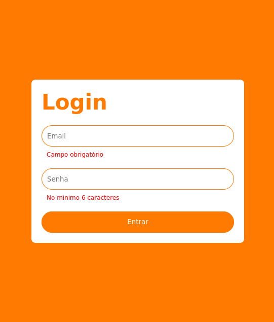

# Implementando Uma Tela de Login Com Validação Usando TypeScript

   Este código mostra uma função chamada "Login", que é um componente React. O componente renderiza um formulário de login com dois campos de entrada, um para o e-mail e outro para a senha, e um botão de "entrar".

A função "useForm" do pacote "react-hook-form" é usada para gerenciar o estado do formulário e as validações. É utilizado o pacote "yup" para a criação das validações do formulário, as quais são passadas ao resolver "yupResolver" do pacote "@hookform/resolvers/yup" .

## Tecnologias utilizadas:

   * React.js
   * react-hook-form
   * yup
   * TypeScript
   * Styled Components for styling

Projeto proposto pela [Digital Innovation One](https://www.dio.me/)
